### Hey, I'm George 👋

I'm a 21 year old developer in Toronto. I build things that I want to understand to the bone, mostly around AI agents, ML models, and data systems. Right now I'm obsessed with the guardrails that stop AI agents from wreaking havoc in codebases, so teams can move fast without breaking things.

- 🇨🇦🇦🇲🇰🇿 Based in Toronto. Armenian and Kazakh roots.
- 🧠 Obsessing over focus, flow states, and how to use AI to amplify thinking instead of replacing it.
- 🤖 Building AI agents that score leads, orchestrate tasks, and manage data pipelines.
- 🎸 Play fingerstyle guitar when I'm not on a screen.
- 🏌️ Started playing golf weekly... wasn't expecting it to be that fun
- 🌍 Speak English, Russian, French. Understand Spanish.
- 💬 Ask me about **AI agents, data architecture, productivity, or why most devs are getting dumber with AI**.

12-hour sessions on one project come easy, but so does burning out after a few of them. Working on fixing that (blog soon).  But projects that outlasted the burnout... well:

- 🏠 sift - AI lead scoring for real estate agents. Figures out which buyers are serious.
- 🏃🏼 [MEZA Run Club](https://mezarun.com) - Community platform for MEZA Run Club. 400+ views and 20+ signups in 5 days, ranked top of Google.
- 📬 [sendable](https://sndbl.com) - Audits emails for deliverability and tracks domain reputation via DMARC. (Paused)
- 🏥 [locvm](https://github.com/locvm) - A marketplace for Physicians and Clinics. ([Locvm](https://www.locvm.ca))
- 📦 avqsklad - ERP, database, and QuickBooks all in one. Tracks everything in one spot. ([Avateq](https://www.avateq.com))
- 📡 [logreader](https://www.avateq.com/logreader/) - UHF/VHF signal analysis and coverage prediction. ([Avateq](https://www.avateq.com)) · [Featured on TV Tech 📰](https://www.tvtechnology.com/insights/opinion/atsc-3-0-at-nab-show-focused-on-brazil-low-cost-receivers)
- 🖥️ AVQ-Support - Fully automated Tech Support for Avateq (Reduce simple question calls)
- 🔊 quickNotes - iOS app for podcast notes with quick paste into Notion/Obsidian.
- 📝 mdOrc - Tool that understands .md files, orchestrates context-aware prompt additions, and continously learns.
- 🗺️ [Kava](https://www.mykava.app) - An IOS app that record what cafes you've already been to!

I'm always building something. If any of this is interesting, reach out.

### Contributions

- 🧹 [vorssaint-utils](https://github.com/vorssaint/vorssaint-utils) - Forgotten screenshots category for the Cleaner. Shipped and credited in the changelog. ([#1862](https://github.com/vorssaint/vorssaint-utils/discussions/1862) · [#2040](https://github.com/vorssaint/vorssaint-utils/pull/2040))

### Recent Blog Posts
<!-- BLOG-POST-LIST:START -->
- [How AI Coding Agents Are Making Developers Dumber (And How to Actually Use Them Right)](https://georgebnov.com/blog/How-AI-Coding-Agents-Are-Making-Developers-Dumber-And-How-To-Actually-Use-Them-Right)
- [How I Built The Most Accurate Data Analysis Web App For UHF And VHF Signals, Part 2](https://georgebnov.com/blog/building-best-data-analysis-tool-Part2)
- [How I Built The Most Accurate Data Analysis Web App For UHF And VHF Signals](https://georgebnov.com/blog/building-best-data-analysis-tool)
- [Aerodynamics as a Software Engineer??? Part 2](https://georgebnov.com/blog/aerodynamics-as-a-software-engineer-part2)
- [Aerodynamics as a Software Engineer??? Part 1](https://georgebnov.com/blog/aerodynamics-as-a-software-engineer)
<!-- BLOG-POST-LIST:END -->
